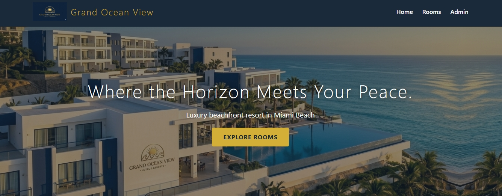
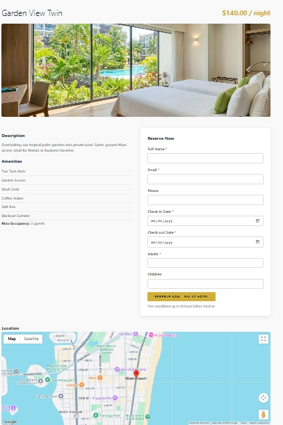
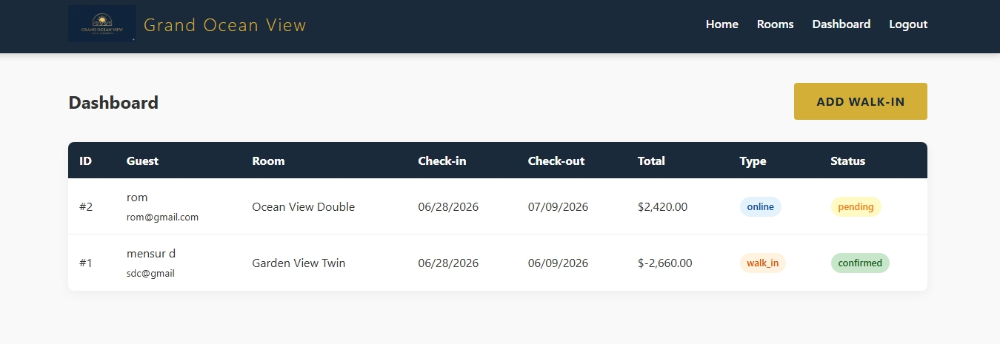

# 🏨 Grand Ocean View - Hotel Booking System

A fully functional hotel reservation system built with PHP, MySQL, HTML, CSS, and JavaScript. It features real-time room availability, a secure admin panel for walk-in customers, and atomic database transactions to prevent double-booking.

## ✨ Features

- Room Browsing: View rooms with images, descriptions, amenities, and prices.
- Online Reservations: Book rooms instantly with date selection.
- Double-Booking Prevention: Uses MySQL SELECT ... FOR UPDATE row-locking to prevent two users from booking the same room simultaneously.
- Admin Dashboard: Manage all reservations.
- Walk-in Support: Staff can book rooms for physical customers directly from the admin panel.
- Google Maps Integration: Shows the hotel location (API key required).
- Email Confirmation: Sends HTML confirmation emails to customers after booking.

## 🛠️ Tech Stack
- Backend: PHP 8.2 (Native)
- Database: MySQL (InnoDB for transactions)
- Frontend: HTML5, CSS3, Vanilla JavaScript
- Server: Apache (XAMPP/WAMP compatible)

## 📸 Screenshots

### Homepage

### Room Detail & Booking

### Admin Dashboard

## 🚀 Installation Guide (Local Setup)

Follow these steps to run this project on your local machine:

1. Clone the repository:
   `bash
   git clone https://github.com/your-username/hotel-booking.git